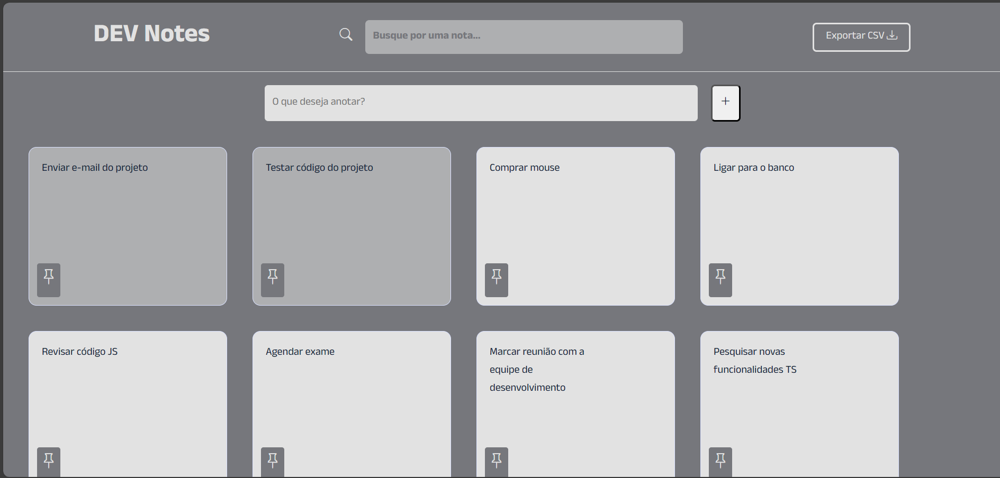

# DEV Notes

Este projeto consiste em uma aplicação de notas simples, inspirada no Google Keep, onde você pode adicionar, pesquisar, fixar, duplicar e exportar suas notas para um arquivo CSV. 
Projeto realizado em curso de formação frontend, utilizando HTML, CSS e JavaScript.

## Tecnologias Utilizadas

- HTML
- CSS
- JavaScript

## Funcionalidades

-  Adicionar Nota: 
    O usuário pode adicionar uma nova nota digitando o conteúdo desejado no campo de entrada e clicando no botão de adicionar (+).
    A funcionalidade de adicionar nota é implementada pela função addNote(). Ela cria um objeto representando a nota com um ID único e o conteúdo digitado pelo usuário. Em seguida, a nota é exibida na interface e armazenada no armazenamento local do navegador.

- Pesquisar Nota: 
    Há um campo de pesquisa onde o usuário pode buscar por notas específicas. A busca é realizada em tempo real, filtrando as notas de acordo com o texto inserido. A cada tecla pressionada, o evento keyup é acionado, e a função searchNotes(search) é chamada. Esta função filtra as notas que contêm o texto de busca e exibe apenas as correspondências na interface.

- Fixar/Desafixar Nota: 
    Ao clicar no ícone de alfinete (📌) em uma nota, o usuário pode fixá-la ou desafixá-la da lista. Notas fixadas permanecem no topo da lista.
    Esta ação é controlada pela função toggleFixNote(). Quando um usuário clica no ícone, a função é chamada, alterando o estado fixado da nota correspondente e atualizando a interface para refletir essa alteração.

- Duplicar Nota: 
    Clicando no ícone de adição (+) em uma nota, o usuário pode duplicá-la, criando uma cópia idêntica da nota. Assim, a função copyNote(id) é acionada. Essa função cria uma cópia idêntica da nota selecionada, gerando um novo ID único para a nota duplicada. A cópia é então exibida na interface e armazenada no armazenamento local.

- Exportar Notas: 
    O botão "Exportar CSV" permite ao usuário exportar todas as notas para um arquivo CSV. Isso é útil para fazer backup ou transferir as notas para outros dispositivos. A função exportData() é chamada quando o botão é clicado. Ela gera uma string CSV contendo os IDs, conteúdos e estados de fixação de todas as notas e cria um link de download para o arquivo CSV.

## Contribuições

Contribuições são bem-vindas! 

## Autor

- [@RaquelGui](https://www.github.com/RaquelGui)

Sinta-se à vontade para utilizar, modificar e adaptar este conteúdo, de acordo com as necessidades específicas do seu projeto.

## Screenshot do Projeto

  